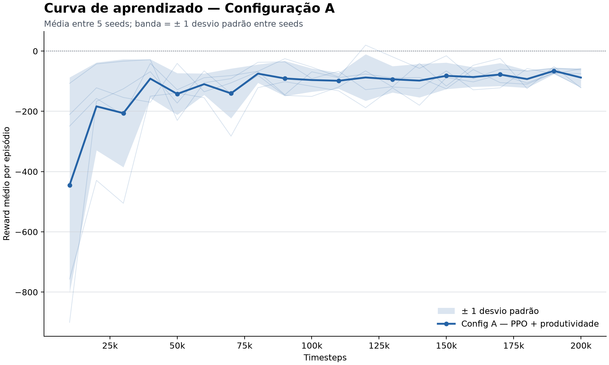
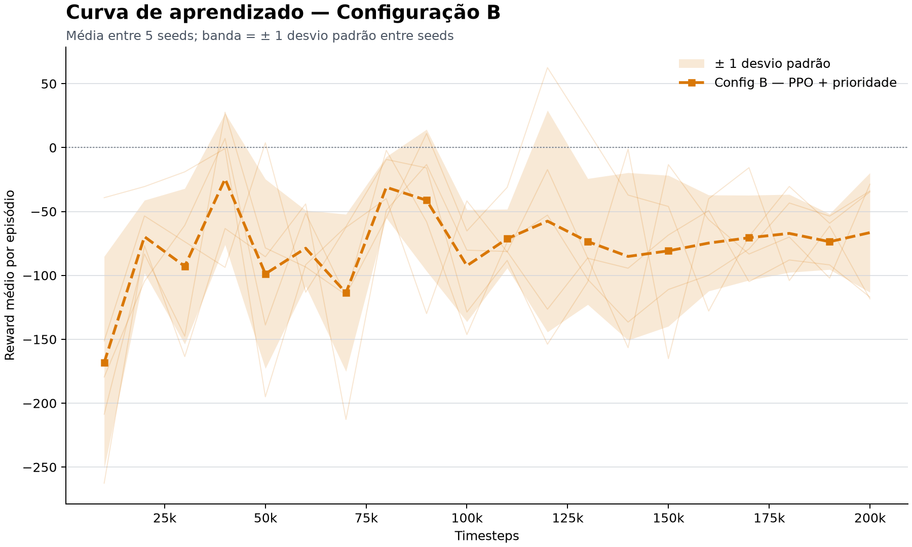
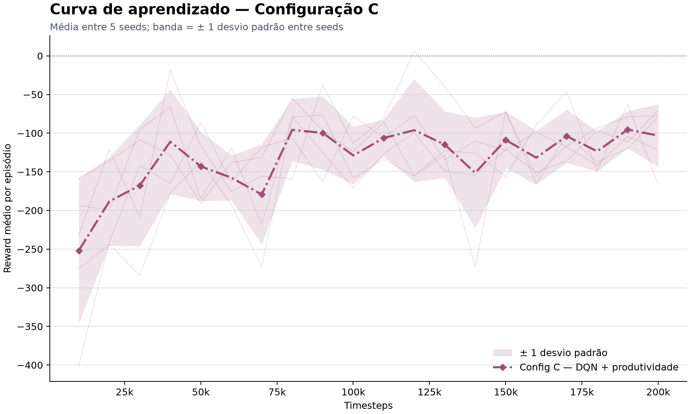

# Resumo

Este trabalho modela a triagem de chamados como um Processo de Decisão de Markov. Três filas recebem solicitações segundo distribuições de Poisson, e um agente escolhe entre duas regras de atendimento e ações de encaminhamento. A equipe implementou o ambiente com Gymnasium e treinou agentes PPO e DQN com Stable-Baselines3. O protocolo compara três configurações e três baselines em cinco sementes, com 200.000 passos por treino e 100 episódios por avaliação.

A Configuração A, PPO com recompensa de produtividade, obteve o maior reward na avaliação comum: -78,67, contra -112,65 da Configuração C e -136,28 da Configuração B. A Configuração A também registrou o menor custo médio, 159,06 por episódio. Os três agentes superaram as baselines aleatória e fila mais longa. A Configuração B apresentou comportamento quase igual ao da prioridade fixa. Na seed surpresa 999, as configurações A e C sofreram degradação moderada; a Configuração B sofreu queda de 16,0%.

A análise encontrou duas limitações na modelagem. A variável de capacidade não restringe as decisões nas execuções padrão porque o ambiente libera no mesmo passo a unidade que aloca. O contador `total_served` também inclui encaminhamentos, embora a recompensa trate encaminhar e atender de formas distintas. Essas escolhas não invalidam a comparação executada, pois todos os métodos usaram o mesmo ambiente, mas limitam a interpretação da taxa de sucesso e do uso de recursos.

**Palavras-chave:** aprendizagem por reforço; triagem; Gymnasium; PPO; DQN; filas.

<div class="page-break"></div>

# Descrição do problema

Um centro de atendimento recebe chamados com volumes e níveis de prioridade distintos. A operação precisa resolver casos críticos sem abandonar filas de menor prioridade. A chegada de novos chamados muda a carga ao longo do turno, portanto uma regra fixa pode produzir espera excessiva quando a demanda foge do padrão esperado.

O ambiente usa três filas:

| Fila | Peso de prioridade | Taxa de chegada por passo |
|---:|---:|---:|
| 0 | 1, baixa | 0,3 |
| 1 | 2, média | 0,5 |
| 2 | 3, alta | 0,2 |

Cada episódio representa um turno com até 100 passos. Em cada passo, o agente escolhe uma ação, o ambiente sorteia novas chegadas e atualiza espera, custos e recompensa. A política precisa responder a sequências de chegadas que mudam entre episódios.

# Adequação à aprendizagem por reforço

A triagem exige decisões sequenciais. Uma ação reduz uma fila no passo atual e altera as penalidades futuras de espera. O agente recebe observações do sistema, escolhe uma ação e acumula recompensas durante o turno. Essa interação corresponde à formulação de aprendizagem por reforço descrita por Sutton e Barto [1].

O problema contém os elementos de complexidade exigidos pela atividade:

- chegadas estocásticas segundo distribuições de Poisson;
- objetivos ligados a produtividade, prioridade e tempo de espera;
- custos por encaminhamento, descarte e ações sem efeito;
- recompensa atrasada, pois uma fila mantida em espera gera penalidades crescentes;
- risco de encerramento por sobrecarga.

A implementação declara uma restrição de capacidade. A dinâmica atual não sustenta essa restrição durante as execuções padrão, conforme a Seção 11.1. Os demais elementos mantêm a natureza sequencial e estocástica do problema.

# Modelagem como Processo de Decisão de Markov

O projeto representa a tarefa pela tupla $\langle S, A, T, R, \gamma \rangle$, com fator de desconto $\gamma = 0{,}99$.

## Estado

Para três filas, o agente recebe um vetor com nove posições:

$$
s_t = [q_0,q_1,q_2,w_0,w_1,w_2,C,C_u,t]
$$

onde:

- $q_i$ contém a quantidade de chamados na fila $i$;
- $w_i$ contém o contador de espera associado à fila $i$;
- $C$ contém a capacidade nominal total;
- $C_u$ contém a capacidade em uso;
- $t$ contém o passo do episódio.

O ambiente mantém os pesos de prioridade na configuração: $[1,2,3]$. O vetor não repete esses valores porque cada posição identifica uma fila fixa. O agente aprende a associação entre índice e prioridade durante o treino.

O `observation_space` usa `Box` com valores `float32` e limites conhecidos. Cada fila comporta até 50 chamados. O passo varia de 0 a 100.

O campo chamado `avg_wait_times` funciona como um contador da permanência contínua de cada fila em estado não vazio. Ele não acompanha a idade de cada chamado e, por isso, não calcula a média aritmética dos tempos individuais. A Seção 11.2 discute o impacto dessa aproximação.

## Ações

O ambiente usa `Discrete(4)`:

| Ação | Operação |
|---:|---|
| 0 | atender um chamado da fila não vazia com maior prioridade |
| 1 | atender um chamado da fila mais longa |
| 2 | encaminhar um chamado da fila 0 |
| 3 | encaminhar um chamado da fila 1 |

As ações 0 e 1 delegam a escolha da fila a duas heurísticas. O agente aprende quando usar cada regra e quando encaminhar. O espaço atual não oferece encaminhamento da fila 2, que concentra os casos críticos. Essa decisão reduz o espaço de busca, mas impede uma política de encaminhamento simétrica entre filas.

Uma ação de atendimento sobre filas vazias recebe penalidade de 0,3. O ambiente aplica penalidade de 0,5 quando a capacidade bloqueia o atendimento. O encaminhamento de uma fila vazia também custa 0,3.

## Transição

Cada chamada a `step()` executa a sequência abaixo:

1. o ambiente processa a ação escolhida;
2. cada fila recebe um número de chegadas amostrado de uma Poisson;
3. o ambiente incrementa o contador de espera das filas não vazias;
4. o ambiente libera uma unidade de capacidade;
5. o ambiente calcula a recompensa e testa o término.

Chamados que chegam a uma fila cheia são descartados. Cada descarte gera penalidade de 2,0.

## Funções de recompensa

O experimento usa duas funções.

### Produtividade

$$
r_t = N_{atendidos} - P_{atraso} - P_{ação} - P_{descarte}
$$

Cada atendimento soma 1,0. Para uma fila com contador de espera acima do limiar 3, o ambiente subtrai:

$$
P_{atraso,i} = 0{,}1(w_i - 3)
$$

### Prioridade

$$
r_t = \sum_i N_{atendidos,i}p_i - \sum_i p_iP_{atraso,i} - P_{ação} - P_{descarte}
$$

O peso $p_i$ aumenta o ganho de atender filas críticas e a penalidade de deixá-las esperando. O encaminhamento custa 0,5 e não recebe o bônus de atendimento.

As duas recompensas operam em escalas diferentes. O relatório não compara os valores das curvas de treino da Configuração B com A ou C como se medissem o mesmo objetivo. Na comparação final, o script reavaliou os seis métodos com a recompensa de produtividade.

## Episódios e critérios de término

O método `reset(seed)` esvazia as filas, zera os contadores e configura o gerador de números aleatórios. Um episódio termina em uma destas condições:

- o turno alcança 100 passos;
- as três filas permanecem acima de 80% da capacidade por dez passos consecutivos.

As avaliações registradas terminaram no horizonte de 100 passos. O critério de sobrecarga não ocorreu nas amostras finais.

# Implementação com Gymnasium

A equipe criou a classe `TriagemEnv`, derivada de `gymnasium.Env`, e registrou o identificador `TriagemAdaptativa-v0`. A implementação segue a interface `reset()`, `step()`, `render()`, `observation_space` e `action_space` descrita pelo Gymnasium [2].

O método `info` expõe tamanhos e esperas das filas, capacidade usada, passo, chegadas, saídas registradas, custo e saídas por fila. Os scripts usam esses campos para calcular taxa de sucesso, custo e análise por fila.

O modo `ansi` retorna uma representação textual. O modo `human` imprime a mesma estrutura no terminal. A visualização mostra barras de ocupação, espera e capacidade.

Os testes automatizados cobrem contrato Gymnasium, recompensas, término, sementes, ações inválidas, baselines e contadores. Durante a revisão deste relatório, 91 testes do ambiente, das baselines e dos contadores passaram. Outros nove testes das rotinas de análise também passaram. O linter Ruff não encontrou erros.

# Agentes

A equipe usou as implementações da Stable-Baselines3 [3]. Os dois agentes recebem o vetor de estado por uma política `MlpPolicy`.

## PPO

O PPO atualiza uma política por gradiente e limita mudanças bruscas por meio do objetivo com clipping [4]. O projeto usa os parâmetros abaixo:

| Parâmetro | Valor |
|---|---:|
| `learning_rate` | 0,0003 |
| `n_steps` | 2.048 |
| `batch_size` | 64 |
| `n_epochs` | 10 |
| `gamma` | 0,99 |
| `gae_lambda` | 0,95 |
| `clip_range` | 0,2 |
| `ent_coef` | 0,01 |

O PPO aceita observações contínuas e ações discretas. O termo de entropia preserva exploração durante o treino.

## DQN

O DQN aproxima o valor de cada ação com uma rede neural. O algoritmo usa replay buffer, target network e exploração epsilon-greedy, mecanismos presentes na formulação de Mnih et al. [5].

| Parâmetro | Valor |
|---|---:|
| `learning_rate` | 0,001 |
| `buffer_size` | 50.000 |
| `batch_size` | 32 |
| `gamma` | 0,99 |
| `exploration_fraction` | 0,1 |
| `exploration_final_eps` | 0,02 |
| `train_freq` | 4 |

# Baselines

O protocolo compara os agentes com três políticas sem treino:

| Baseline | Regra |
|---|---|
| Aleatória | sorteia uma ação uniforme em `Discrete(4)` |
| Prioridade fixa | escolhe a ação 0 em todos os passos |
| Fila mais longa | escolhe a ação 1 em todos os passos |

A baseline aleatória mede o desempenho sem política. As outras duas representam regras operacionais plausíveis e correspondem às comparações sugeridas para o Grupo 4.

# Protocolo experimental

## Configurações

| Configuração | Algoritmo | Recompensa de treino | Objetivo |
|---|---|---|---|
| A | PPO | produtividade | aumentar o volume atendido e conter atrasos |
| B | PPO | prioridade | aumentar o peso dos casos críticos |
| C | DQN | produtividade | comparar DQN e PPO sob a mesma recompensa |

## Sementes e treino

Cada configuração usou as sementes 42, 123, 256, 789 e 1024, totalizando 15 treinos. Cada treino executou 200.000 passos. O código propaga a seed para `random`, NumPy, PyTorch, Gymnasium e Stable-Baselines3.

O `EvalCallback` avaliou o agente a cada 10.000 passos em dez episódios determinísticos. O treino salvou o modelo final e o melhor modelo observado pelo callback. Os gráficos agregam as cinco sementes e mostram um desvio padrão entre sementes.

## Avaliação final

Cada modelo executou 100 episódios. Cada baseline também executou 100 episódios em cada uma das cinco sementes. O script final avaliou A, B e C com a recompensa de produtividade para permitir a comparação direta de reward com as baselines.

As métricas usadas foram:

- reward médio por episódio;
- taxa de sucesso, calculada por `total_served / total_arrivals`;
- passos por episódio;
- custo acumulado;
- desvio padrão entre sementes;
- quantidade média registrada por fila;
- desempenho na seed surpresa.

O contador `total_served` inclui atendimentos e encaminhamentos. A taxa de sucesso mede, portanto, a proporção de chamados que saíram das filas pela ação do agente. Ela não separa resolução local de encaminhamento.

## Seed surpresa

O teste usa a seed mestra 999 para gerar 100 seeds de episódio que não pertencem ao conjunto de treino. Os 15 checkpoints recebem a mesma coorte. O protocolo classifica uma queda de até 5% como boa generalização, de 5% a 15% como moderada e acima de 15% como degradação severa.

# Resultados

## Curvas de aprendizado

{ width=95% }

A Configuração A saiu de -444,94 em 10.000 passos e chegou a -87,78 em 200.000. O menor valor absoluto no fim do treino ocorreu em 190.000 passos, com -65,63. A dispersão caiu de 357,81 para 31,21.

A Configuração B saiu de -168,25 e chegou a -66,52. Essa curva usa a recompensa de prioridade, por isso sua escala não permite comparação direta com A e C. A Configuração C saiu de -251,95 e chegou a -103,16. As três curvas oscilaram após a melhora inicial, efeito esperado em avaliações com chegadas estocásticas e dez episódios por checkpoint.

{ width=82% }

{ width=82% }

{ width=82% }

## Desempenho final

| Método | Reward médio | Taxa de sucesso | Passos | Custo médio | DP entre seeds |
|---|---:|---:|---:|---:|---:|
| A - PPO produtividade | **-78,67** | 91,76% | 100,00 | **159,06** | 11,78 |
| B - PPO prioridade | -136,28 | 91,78% | 100,00 | 227,88 | 10,36 |
| C - DQN produtividade | -112,65 | 91,21% | 100,00 | 202,69 | 16,92 |
| Aleatória | -418,93 | 88,91% | 100,00 | 467,12 | 19,27 |
| Prioridade fixa | -137,19 | 91,78% | 100,00 | 228,84 | 11,07 |
| Fila mais longa | -416,31 | 91,78% | 100,00 | 507,95 | 36,57 |

{ width=92% }

A Configuração A obteve o maior reward e o menor custo. A Configuração C ficou em segundo lugar nessas duas métricas. A Configuração B superou a prioridade fixa por 0,91 ponto de reward, diferença menor que os desvios entre sementes. O experimento não aplicou teste de significância, portanto não sustenta uma diferença estatística entre esses dois métodos.

As taxas de sucesso ficaram próximas de 92% para cinco métodos. A baseline aleatória atingiu 88,91%. A semelhança decorre do limite de uma retirada por passo e da inclusão dos encaminhamentos no numerador. O reward e o custo distinguem melhor as políticas porque incorporam espera e ações sem efeito.

## Atendimento por fila

{ width=95% }

A Configuração A registrou 26,32 saídas na fila 0, 46,25 na fila 1 e 19,06 na fila 2. A Configuração B registrou 23,65, 48,50 e 19,49. Seus valores coincidem com a baseline de prioridade fixa nas três filas. Esse resultado mostra que o PPO com recompensa de prioridade convergiu para a regra que escolhe a fila crítica disponível.

A taxa de chegada da fila 2 é a menor, 0,2 por passo. Por isso, o número absoluto de atendimentos críticos fica abaixo do volume da fila 1 mesmo quando a política os escolhe primeiro.

## Análise de episódios bem-sucedidos e com falha

A análise qualitativa executou 100 episódios da Configuração A com o checkpoint treinado na seed 123. O critério operacional classificou reward maior ou igual a zero como sucesso. A amostra contém 31 sucessos e 69 falhas sob esse critério.

| Grupo | Seed do episódio | Reward | Saídas/chegadas | Ação dominante |
|---|---:|---:|---:|---|
| sucesso 1 | 10025 | 58,8 | 83/85 | prioridade, 98% |
| sucesso 2 | 10037 | 53,0 | 85/87 | prioridade, 96% |
| sucesso 3 | 10002 | 49,4 | 83/89 | prioridade, 97% |
| falha 1 | 10073 | -479,1 | 99/121 | prioridade, 65% |
| falha 2 | 10069 | -411,2 | 99/132 | prioridade, 70% |
| falha 3 | 10055 | -405,2 | 97/124 | prioridade, 87% |

Os sucessos receberam entre 85 e 89 chegadas, enquanto as falhas receberam entre 121 e 132. O agente retirou perto de um chamado por passo nos episódios de falha, mas não acompanhou o volume de entrada. As filas permaneceram ocupadas e acumularam espera. No episódio 10073, o contador máximo chegou a 79 passos na fila 0 e 58 na fila 1.

A ação de prioridade respondeu por 85,93% das decisões na amostra. Sua participação subiu para 92,65% nos sucessos e caiu para 82,91% nas falhas. O encaminhamento da fila 0 apareceu em 2,48% das ações dos sucessos e 11,68% das ações das falhas. A associação não prova que encaminhar causou o reward baixo, pois os episódios de falha também receberam mais chamados.

## Generalização na seed surpresa

| Configuração | Reward de referência | Reward na seed 999 | Queda | Classificação |
|---|---:|---:|---:|---|
| A | -78,67 | -84,17 | 7,0% | moderada |
| B | -136,28 | -158,10 | 16,0% | severa |
| C | -112,65 | -127,25 | 13,0% | moderada |

A Configuração A apresentou a menor queda. A taxa de sucesso da Configuração A subiu de 91,76% para 91,97%, apesar do reward menor. A diferença indica aumento das penalidades de espera ou de ação, sem redução na proporção de saídas. A Configuração B mostrou maior sensibilidade à nova coorte.

Uma seed surpresa avalia uma coorte não vista. Ela não mede generalização sobre todas as distribuições de demanda. O resultado serve como teste de robustez para a apresentação e como ponto de partida para novas avaliações.

# Análise crítica

## Utilidade da política aprendida

A Configuração A aprendeu uma política útil dentro do ambiente implementado. Ela reduziu o custo em 66% frente à baseline aleatória e em 69% frente à fila mais longa. Também superou a prioridade fixa em reward, com diferença de 58,53 pontos. A política combina prioridade, fila longa e encaminhamento, embora concentre 85,93% das decisões na ação de prioridade.

A Configuração C também superou as três baselines em reward. Seu desvio entre sementes, 16,92, ficou acima dos desvios de A e B, mas abaixo de 20% do valor absoluto da média. O DQN mostrou estabilidade suficiente para a comparação proposta.

A Configuração B reproduziu a baseline de prioridade fixa. A distribuição por fila coincide, e os rewards diferem por menos de um ponto na avaliação comum. O agente aprendeu uma política coerente com sua recompensa de treino, mas não criou vantagem mensurável sobre a heurística que já codificava o mesmo objetivo.

## Estabilidade

Os desvios entre sementes equivalem a 15,0% do valor absoluto da média em A, 7,6% em B e 15,0% em C. Esses valores atendem ao limite interno de 20%. As curvas ainda mostram oscilações entre checkpoints. Dez episódios por avaliação durante o treino deixam a média sensível às chegadas sorteadas.

## Efeito da recompensa

A recompensa de produtividade favoreceu a Configuração A na avaliação comum. A recompensa de prioridade empurrou a Configuração B para a ação 0, que já implementa uma regra de prioridade fixa. O desenho da ação reduz o espaço de políticas que B precisa explorar. Esse acoplamento explica a proximidade entre o agente e a baseline.

O reward diferencia políticas com taxas de sucesso parecidas porque cobra espera acumulada. Essa propriedade ajuda a medir qualidade de serviço. O contador de espera, porém, representa a idade contínua da fila, não a média individual. Filas com entradas recentes podem receber penalidade calculada a partir de chamados mais antigos.

# Limitações e melhorias futuras

## Capacidade nominal sem efeito persistente

O ambiente incrementa `used_capacity` ao atender e libera uma unidade no mesmo passo. Como os episódios começam em zero e cada ação atende no máximo um chamado, a capacidade usada retorna a zero. Uma execução de controle com seed 42 produziu o mesmo reward, 26,7, e 91 atendimentos tanto com capacidade 1 quanto com capacidade 10.

Essa dinâmica impede a análise de alocação de recursos. Uma versão futura deve atribuir duração aos atendimentos e manter uma lista de serviços em curso. O ambiente liberaria cada vaga após o término do serviço. Essa alteração mudaria o MDP e exigiria novo treino dos 15 agentes; por isso, a equipe preservou a dinâmica usada para gerar os resultados deste relatório.

## Espera agregada por fila

O vetor guarda um contador por fila. Ele não guarda a idade de cada chamado. Uma fila que permanece ocupada por muitos passos mantém um valor alto mesmo após receber chamados novos. Uma implementação futura deve armazenar tempos individuais ou uma soma de idades e calcular a média após cada entrada e saída.

## Encaminhamento e taxa de sucesso

O código incrementa `total_served` quando encaminha um chamado, mas aplica apenas o custo de encaminhamento na recompensa. A taxa de sucesso agrega atendimento local e encaminhamento. O relatório interpreta essa métrica como taxa de saída registrada.

Uma revisão deve criar `total_referred` e manter `total_resolved` apenas para atendimentos locais. A avaliação passaria a publicar taxa de resolução, taxa de encaminhamento e taxa de abandono. O mesmo ajuste permitiria calcular o custo de cada operação sem inferência.

## Espaço de ações

As ações 0 e 1 contêm as duas heurísticas usadas como baselines. O agente escolhe entre regras prontas, em vez de escolher uma fila para atendimento. Esse desenho permite uma política de alto nível, mas limita a descoberta de estratégias fora das heurísticas.

Uma versão futura pode oferecer `atender_fila_0`, `atender_fila_1`, `atender_fila_2`, encaminhamentos por fila e espera. A fila 2 também deve receber uma ação de encaminhamento caso o domínio permita transferir casos críticos.

## Evidência estatística e artefatos

As barras de erro mostram dispersão entre cinco seeds. O estudo não aplicou intervalos de confiança, teste pareado ou correção para múltiplas comparações. Novos experimentos podem usar bootstrap pareado sobre seeds de episódio e informar o tamanho do efeito.

O repositório versiona CSVs, gráficos e relatórios de análise. Ele ignora checkpoints e arquivos `evaluations.npz` por tamanho. A reprodução integral exige treinar os 15 modelos. Para a demonstração, a equipe deve manter cópias locais dos checkpoints usados.

# Uso de IA generativa

O grupo usou ferramentas de IA generativa como apoio na organização do código, revisão dos requisitos, discussão de alternativas e redação deste relatório. Os integrantes confrontaram as sugestões com o enunciado, os arquivos `.specs`, o código-fonte, os testes e os CSVs gerados pelos experimentos.

A equipe manteve no texto as limitações encontradas durante a revisão. Os scripts produziram as métricas, tabelas e gráficos; a IA não substituiu a execução experimental. Cada integrante deve conhecer a modelagem, as recompensas e as limitações descritas para responder à arguição.

# Conclusão

O projeto implementou um ambiente próprio de triagem, treinou PPO e DQN e comparou seis métodos sob um protocolo com cinco sementes. A Configuração A apresentou o melhor resultado final e a menor degradação na seed surpresa. A Configuração B convergiu para a prioridade fixa, enquanto o DQN ocupou a segunda posição na avaliação comum.

Os resultados sustentam aprendizado dentro da dinâmica implementada. A interpretação deve considerar a capacidade nominal sem efeito persistente e a inclusão de encaminhamentos em `total_served`. As próximas versões precisam corrigir essas duas escolhas e repetir o protocolo antes de comparar os números com os atuais.

# Referências

[1] SUTTON, Richard S.; BARTO, Andrew G. *Reinforcement Learning: An Introduction*. 2. ed. Cambridge: MIT Press, 2018. Disponível em: <http://incompleteideas.net/book/the-book-2nd.html>.

[2] TOWERS, Mark et al. Gymnasium: A Standard Interface for Reinforcement Learning Environments. *Advances in Neural Information Processing Systems*, 2025. Disponível em: <https://arxiv.org/abs/2407.17032>.

[3] RAFFIN, Antonin et al. Stable-Baselines3: Reliable Reinforcement Learning Implementations. *Journal of Machine Learning Research*, v. 22, n. 268, p. 1-8, 2021. Disponível em: <https://www.jmlr.org/papers/v22/20-1364.html>.

[4] SCHULMAN, John et al. Proximal Policy Optimization Algorithms. *arXiv preprint arXiv:1707.06347*, 2017. Disponível em: <https://arxiv.org/abs/1707.06347>.

[5] MNIH, Volodymyr et al. Human-level control through deep reinforcement learning. *Nature*, v. 518, p. 529-533, 2015. DOI: <https://doi.org/10.1038/nature14236>.

[6] UNIVERSIDADE DO ESTADO DA BAHIA. *Trabalho 4: Aprendizagem por Reforço - Descrição da Atividade; Temas para os Grupos; Entregáveis e Critérios de Avaliação*. Disciplina de Inteligência Artificial, semestre 2026.1.

# Apêndice A - Execução

Instalação com o arquivo equivalente a `requirements.txt`:

```bash
uv sync
```

Treino completo:

```bash
bash run_pipeline.sh
```

Avaliação e geração das análises a partir de checkpoints existentes:

```bash
# PowerShell
.\run_analysis.ps1 -SurpriseSeed 999

# Bash
bash run_analysis.sh 999
```

Execução dos testes:

```bash
uv run pytest tests -q
uv run ruff check .
```
