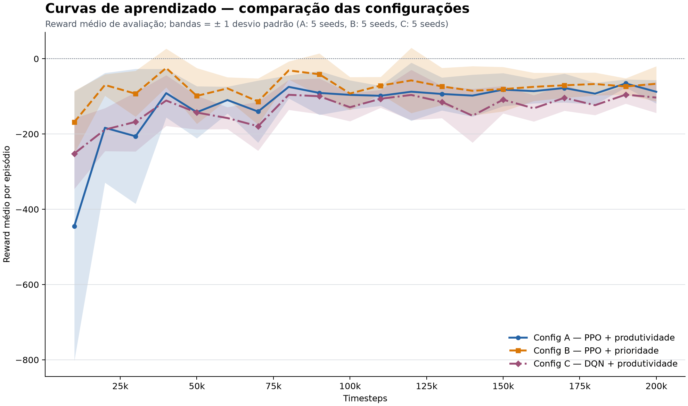
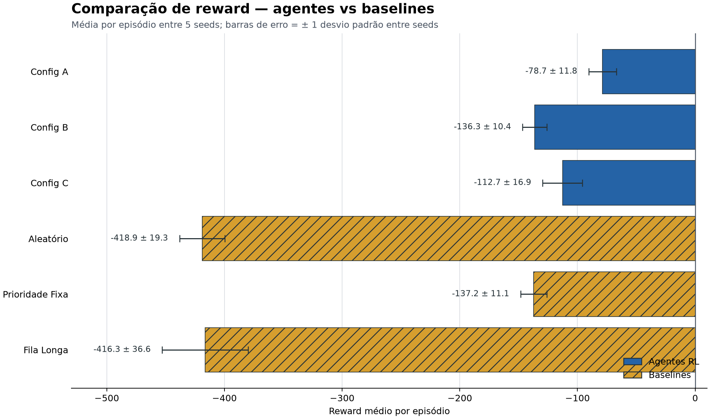
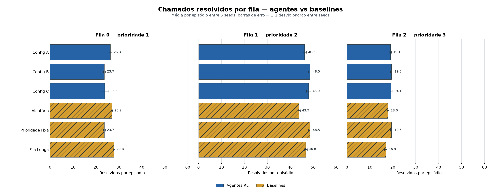

# Problema e modelagem

## Triagem com filas e prioridades distintas

- Um centro recebe chamados em três filas: baixa, média e alta prioridade.
- O agente escolhe a regra de atendimento ou encaminha um chamado.
- Chegadas Poisson mudam a carga; espera, descarte e encaminhamento geram custo.
- O objetivo operacional combina volume atendido e proteção dos casos críticos.

## A decisão atual afeta o custo futuro

- Atender uma fila reduz sua carga, mas deixa as outras acumularem espera.
- A demanda é estocástica; uma regra fixa não antecipa todas as sequências.
- O reward soma ganhos imediatos e penalidades que crescem ao longo do turno.
- O episódio termina em 100 passos ou após sobrecarga prolongada.

## Modelagem como MDP

- **Estado:** filas, espera, capacidade nominal, uso e passo.
- **Ações:** duas regras de atendimento e dois encaminhamentos.
- **Transições:** ação, chegadas Poisson, espera, custo e término.
- **Desconto:** $\gamma = 0{,}99$.

## Estado

$$s_t = [q_0,q_1,q_2,w_0,w_1,w_2,C,C_u,t]$$

- $q_0\ldots q_2$: quantidade de chamados em cada fila.
- $w_0\ldots w_2$: permanência contínua da fila em estado não vazio.
- $C$ e $C_u$: capacidade nominal e capacidade em uso.
- $t$: passo atual do episódio.

## Ações: Discrete(4)

| Ação | Operação |
|---:|---|
| 0 | Atender pela maior prioridade |
| 1 | Atender a fila mais longa |
| 2 | Encaminhar um chamado da fila 0 |
| 3 | Encaminhar um chamado da fila 1 |

A política atua como seletora de heurísticas. Ela não escolhe diretamente uma fila para atendimento.

## Duas recompensas

**Produtividade**

- +1 por atendimento local;
- penalidade por espera acima do limiar;
- custos de descarte, encaminhamento e ação sem efeito.

**Prioridade**

- +peso da fila atendida;
- espera ponderada pela prioridade;
- os mesmos custos operacionais.

# Ambiente e agentes

## Gymnasium, baselines e métricas

- **TriagemEnv** implementa reset, step, render e os espaços Gymnasium.
- Baselines: aleatória, prioridade fixa e fila mais longa.
- O modo human exibe filas, esperas e capacidade no terminal.
- O info separa **total_resolved**, **total_referred** e término por sobrecarga.
- **total_served** continua contando todas as saídas por compatibilidade.

## PPO e DQN

- **PPO:** MlpPolicy, learning rate 3e-4, 2.048 passos por rollout, batch 64, $\gamma=0{,}99$.
- **DQN:** MlpPolicy, learning rate 1e-3, buffer 50.000, batch 32, $\gamma=0{,}99$.

# Protocolo experimental

## Três configurações, cinco sementes

| Configuração | Agente | Recompensa |
|---|---|---|
| A | PPO | produtividade |
| B | PPO | prioridade |
| C | DQN | produtividade |

- Seeds 42, 123, 256, 789 e 1024.
- 200.000 passos por treino; 15 modelos.
- 100 episódios na avaliação final.
- Seed surpresa 999, fora do treino.

# Resultados e conclusões

## Curvas de aprendizado

A recompensa de prioridade usa outra escala; a comparação direta ocorre na avaliação comum.

## PPO produtividade obteve o maior reward médio

- Configuração A: reward -78,67; custo médio 159,06; taxa de saída 91,76%.
- A diferença entre B e prioridade fixa é menor que a dispersão entre sementes.

## A distribuição por fila revela a política aprendida

A configuração B coincide com a prioridade fixa nas três filas. No gráfico legado, “resolvidos” significa saídas por atendimento local ou encaminhamento.

## Episódios bem-sucedidos e com falha

- **Três melhores:** 85 a 89 chegadas, 83 a 85 saídas, reward entre 49,4 e 58,8.
- **Três piores:** 121 a 132 chegadas, 97 a 99 saídas, reward entre -405,2 e -479,1.
- A associação não prova causalidade; os episódios ruins também receberam mais chamados.

## Seed surpresa

| Configuração | Reward | Queda | Leitura |
|---|---:|---:|---|
| A | -84,17 | 7,0% | moderada |
| B | -158,10 | 16,0% | severa |
| C | -127,25 | 13,0% | moderada |

Uma seed surpresa testa uma coorte não vista; ela não demonstra generalização universal.

## Ajustes aplicados sem mudar o MDP

**Implementado**

- contadores de resolução e encaminhamento;
- indicador de término por sobrecarga;
- README, relatório e slides alinhados.

**Preservado para não invalidar os modelos**

- capacidade liberada no mesmo passo;
- espera agregada por fila;
- ações de atendimento como heurísticas.

## Conclusão

- PPO com produtividade apresentou o maior reward e o menor custo.
- DQN ficou em segundo lugar; PPO prioridade reproduziu a baseline fixa.
- Os resultados publicados medem saídas, pois incluem encaminhamentos.
- Os novos contadores melhoram a leitura sem exigir novo treino.
- Próximo experimento: duração de serviço, capacidade persistente e ações diretas por fila.

# Perguntas?
